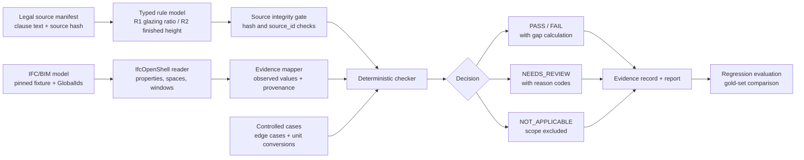

# Reg-to-Evidence

**An auditable BIM compliance review prototype that turns building regulations and IFC model data into traceable evidence records.**

Built with Python · IfcOpenShell · typed rule models · deterministic evaluation · LLM-assisted rule extraction gates

[Example Evidence Report](examples/output/report.md) · [Evaluation Report](examples/output/eval_report.md) · [Self Check](SELF_CHECK.md)

Reg-to-Evidence produces a traceable evidence report for BIM compliance pre-screening: the system reads a regulatory source, maps it to structured IFC/BIM observations, runs deterministic checks, and routes weak or missing evidence to human review.

## Example Output

| rule | element | status | observed evidence | review reasons |
|---|---|---:|---|---|
| R2 finished height | Schlafzimmer | **PASS** | finished_ceiling_height_m=2.500 | - |
| R1 glazing ratio | Schlafzimmer | **REVIEW** | floor_area_m2=21.410 | MISSING_DATA: window Area exists, but glass area is not derivable |
| R2 finished height | Constructed low room | **FAIL** | finished_ceiling_height_m=2.300 | - |
| R2 finished height | Slab-to-slab only case | **REVIEW** | rejected: finished_ceiling_height_m | DEFINITION_MISMATCH: slab-to-slab Height is not substitutable |

The main output is an evidence report in Markdown and JSON. The committed example contains 22 checks: `pass=8`, `fail=2`, `not_applicable=1`, `needs_review=11`.

Full output: [`examples/output/report.md`](examples/output/report.md).

## What It Demonstrates

### 1. Evidence-First BIM Checking

The checker reads real quantities from a pinned IFC fixture (KIT/FZK-Haus) using IfcOpenShell, including finished ceiling height, floor area, window relationships, model SHA-256, IFC GlobalId, property path, raw values, SI values, and units.

### 2. Human Review Routing

When evidence is incomplete, semantically mismatched, or unsafe to coerce, the system returns `NEEDS_REVIEW` with reason codes such as `MISSING_DATA`, `DEFINITION_MISMATCH`, `RULE_SCOPE_UNKNOWN`, `RELATIONSHIP_UNVERIFIED`, and `UNIT_MISMATCH`.

### 3. Validated Rule Extraction

LLM-proposed rules are accepted only after deterministic gates: schema validation, source-span/hash matching, and gold-rule diffing. The LLM output never feeds a compliance verdict directly.

## Architecture



| Layer | Role |
|---|---|
| Source manifest | Stores regulatory excerpts with clause ids and source hashes |
| Rule model | Normalizes checkable requirements into typed fields |
| IFC reader | Extracts BIM quantities and provenance from the pinned model |
| Evidence mapper | Keeps accepted and rejected observations separate |
| Checker | Applies deterministic pass/fail/review logic |
| Evaluation harness | Compares every predicted outcome against a gold set |

## Current Scope

| rule | regulatory example | current support |
|---|---|---|
| R2 | Cap.123F Reg.24(1), finished floor-to-ceiling height >= 2.5 m | full pass / fail / review on real IFC height data |
| R1 | Cap.123F Reg.30(2)(a)(i), glazing area >= 1/10 floor area | full pass / fail / review; real fixture routes to review where glazing fraction is absent |
| Units | mm, cm, ft, mm2, cm2, ft2 and related length/area conversions | convertible units are normalized; missing, unknown, or dimension-inconsistent units route to review |
| R3 | travel distance | designed but not implemented |

## Evaluation

A tiny regression harness scores every prediction against a gold set authored before running:

| Metric | Result |
|---|---:|
| Checks scored | 22 |
| Outcome accuracy | 100.0% (22/22) |
| Applicability accuracy | 100.0% (22/22) |
| Review detection precision | 100.0% |
| Review detection recall | 100.0% |
| Mismatches | 0 |

This is a regression benchmark for the current slice, not a research-grade benchmark.

## 60-Second Run

```bash
uv venv --python 3.13 .venv
uv pip install --python .venv/bin/python -e .
.venv/bin/reg-to-check run \
  --manifest sources/source_manifest.yaml \
  --rules rules.yaml \
  --ifc data/fixtures/AC20-FZK-Haus.ifc \
  --cases data/controlled_cases.json \
  --out out/
```

A committed sample run is available in [`examples/output/`](examples/output/).

To run the evaluation:

```bash
.venv/bin/reg-to-check evaluate \
  --manifest sources/source_manifest.yaml \
  --rules rules.yaml \
  --ifc data/fixtures/AC20-FZK-Haus.ifc \
  --cases data/controlled_cases.json \
  --gold data/gold_set.json \
  --out out/
```

## LLM Rule Extraction

The extractor proposes a typed `RuleCandidate` from each source excerpt, but the candidate must pass three deterministic gates before it is accepted:

1. **Schema gate:** parses into the typed model, with extra fields forbidden.
2. **Source gate:** clause id and source-span hash must match the manifest excerpt.
3. **Gold diff gate:** every checkable field must match the human-authored rule in `rules.yaml`.

The shipped extractor replays a committed cached response, so the pipeline is offline and deterministic. No live model call is bundled.

```bash
.venv/bin/reg-to-check extract \
  --manifest sources/source_manifest.yaml \
  --rules rules.yaml \
  --cache examples/cached_llm_response.json \
  --out out/
```

## Data Provenance

| source mode | meaning |
|---|---|
| `pinned_ifc` | read from `data/fixtures/AC20-FZK-Haus.ifc` with a pinned SHA-256 |
| `constructed_case` | hand-authored edge case, explicitly not from the model |

Pinned fixture: KIT / FZK-Haus standard test model (ArchiCAD export, IFC4), retrieved from the steptools mirror on 2026-07-18.

## Limitations

- Real regulatory excerpts are used, but the check logic is simplified for demonstration.
- R2 omits the 2.3 m under-beam proviso and the sloping-ceiling rule.
- R1 omits the 1/16 openable-area sub-requirement and the prescribed-window condition.
- R1 pass/fail is exercised by constructed cases; the real fixture lacks derivable glazing area, so real R1 spaces route to review.
- The unit converter covers common length and area units, not a general units-of-measure engine.
- The LLM extraction loop uses a cached offline stand-in, not a bundled live model call.
- Results are pre-screening demonstrations, not compliance advice or approval decisions.

## Project Layout

```text
reg_to_check/       models, sources, rules, applicability, IFC reader, mapper,
                    units, checker, evaluator, extractor, report generator, CLI
sources/            source_manifest.yaml with clause excerpts and hashes
rules.yaml          normalized R1/R2 rules referencing the source manifest
data/fixtures/      pinned IFC fixture
examples/output/    committed report, evaluation report, extraction report, JSON outputs
tests/              R1/R2 checks, unit handling, source-integrity tests, CLI smoke tests
SELF_CHECK.md       covered / not covered / future work
```
